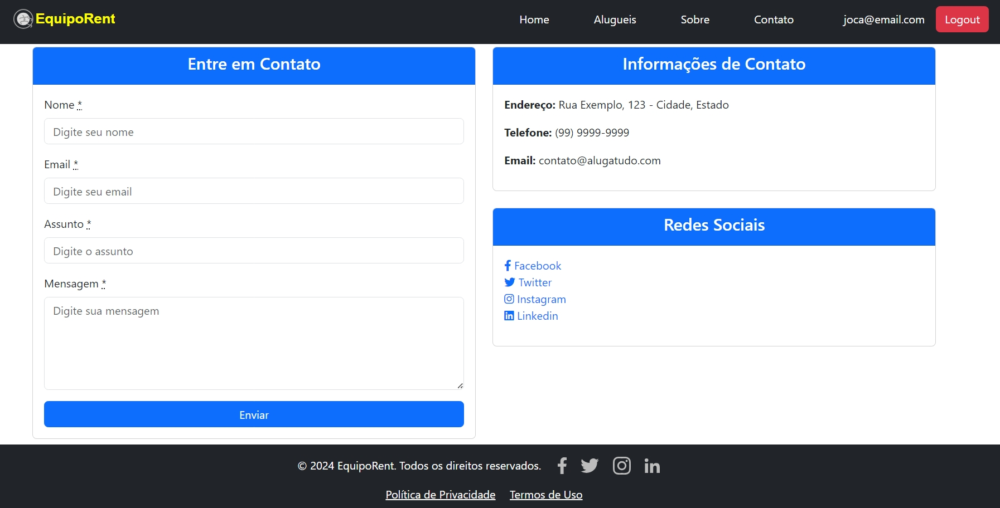
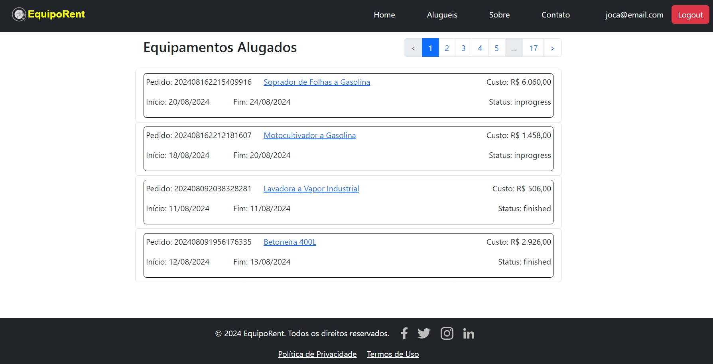
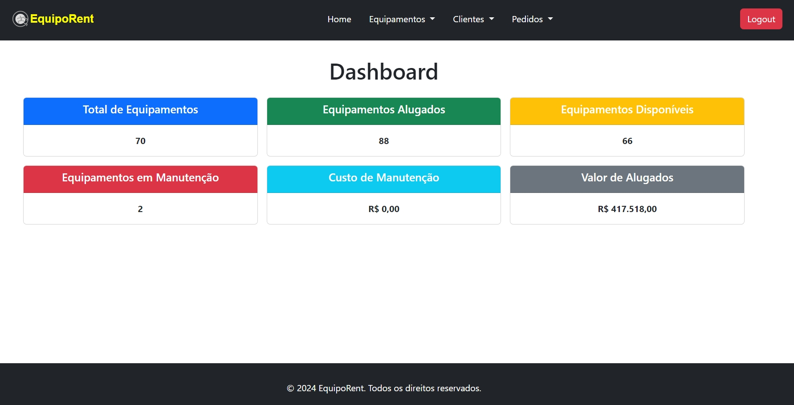

# Easy Rent

O projeto <strong> Easy Rent </strong> foi desenvolvido com base no projeto Sass para Aluguel de Equipamentos(live 29 ==> https://www.youtube.com/watch?v=f3P_et3lzc8, live 30 ==> https://www.youtube.com/watch?v=vveiyzX6ANQ, live 31 ==> https://www.youtube.com/watch?v=jdg0MaTF2-M&t=158s) do canal Invenio Tech no YouTube(https://www.youtube.com/@InvenioTech/featured). Este projeto foi escolhido pela sua relevância para o aprendizado das tecnologias e conceitos que estou atualmente estudando.

Após implementar o projeto original, iniciei uma série de adaptações para atender às minhas ideias e requisitos específicos, focando na gestão eficiente de equipamentos, aluguéis, pagamentos e manutenções.

### Módulo Administrador

    Acesso Restrito: Apenas usuários autenticados como administradores têm acesso a este módulo.

    Dashboard: Apresenta estatísticas do ano corrente, como:
        Quantidade total de equipamentos.
        Equipamentos alugados.
        Equipamentos disponíveis.
        Equipamentos em manutenção.
        Custo total das manutenções.
        Valor total dos equipamentos alugados.

    Gerenciamento de Equipamentos:
        Permite o cadastro, edição e remoção de equipamentos.

    Gerenciamento de Manutenções:
        Possibilita o cadastro de manutenções, com controle sobre datas e custos.

    Gerenciamento de Clientes:
        Cadastro e edição de informações de clientes.
        Controle de dados essenciais como nome, data de nascimento, telefone e documento de identificação (CPF/CNPJ).

    Gerenciamento de Pedidos:
        Criação, cancelamento, finalização e confirmação de pagamento de pedidos.
        Finalização: Os pedidos são finalizados apos a data de término do aluguel.
        Cancelamento: Pedidos com pagamento ainda pendente e data de início vencida, são cancelados.

    Métodos de Pagamento:
        O sistema aceita pagamentos via PIX e boleto bancário.

    Notificações por Email: O sistema envia automaticamente emails para os clientes em diversas situações, como:
        Criação de um novo pedido.
        Cancelamento de um pedido.
        Finalização de um pedido.
        Confirmação de pagamento.

### Módulo Cliente

    Lista de Equipamentos:
        Exibição de uma lista completa de equipamentos, tanto disponíveis quanto indisponíveis, com filtros para facilitar a busca.

    Aluguel de Equipamentos:
        Clientes autenticados podem alugar equipamentos que estejam disponíveis.
        O sistema restringe o aluguel a um equipamento por pedido.

    Métodos de Pagamento:
        Os clientes podem escolher entre cartão de crédito, PIX e boleto para efetuar o pagamento do aluguel.

    Histórico de Aluguéis:
        Os clientes têm acesso somente ao seu histórico de todos os aluguéis realizados, ordenados do mais recente ao mais antigo.

    Contato:
        O sistema oferece um formulário de contato, permitindo que os clientes enviem mensagens diretamente para a empresa.

    Cadastro de Conta:
        Caso o cliente não tenha uma conta, ele pode criar uma durante o processo de aluguel.

### Detalhes

Código do Pedido

    Cada pedido gerado no sistema possui um código numérico único.
    O código é composto pela concatenação da data e hora atual (no formato YYYYMMDDHHMMSSL) com um número aleatório de 0 a 9.

Criação de Contas no Módulo Administrador

    No módulo administrador, as contas de novos administradores devem ser criadas manualmente por um administrador existente.

Cálculo do Valor Total do Aluguel

    O valor total do aluguel é calculado da seguinte forma:
    (data_fim − data_inıcio +1) × valor_diaria_do_equipamento

    Esse cálculo garante que o cliente pague pelo uso de todos os dias, incluindo o dia de início e o dia de término.

### Validações para os Formulários

Contato

    Os campos name, email, subject e message são obrigatórios.

Cliente

    Os campos name, dob, mobile_phone, identification e email são obrigatórios.
    O campo email deve ser único no sistema.
    O campo identification (correspondente a CPF/CNPJ) deve ser validado quanto ao formato:
        CPF: 999.999.999-99
        CNPJ: 99.999.999/9999-99

Manutenção

    Os campos period_start e maintenance_type são obrigatórios.
    O campo period_start deve ser menor ou igual à data atual.
    Os campos period_end e maintenance_value são obrigatórios apenas na ação de edição.
    Para period_end:
        Deve ser menor ou igual à data atual.
        Deve ser maior ou igual a period_start, mas apenas na ação de edição.
    O campo maintenance_value deve ser numérico e maior que zero, apenas na ação de edição.

Pedido

    Os campos period_start, period_end, rent_value, tot_rent_value e payment_method são obrigatórios.
    Os campos rent_value e tot_rent_value devem ser numéricos e maiores que zero.
    O campo period_start deve ser maior ou igual a um dia após a data atual.
    O campo period_end deve ser maior ou igual a period_start.
    Se o payment_method for "cartão de crédito", então os seguintes campos adicionais são obrigatórios:
        credit_card_name
        credit_card_number
        credit_card_expiry_month
        credit_card_expiry_year
        credit_card_security

Equipamento

    Os campos name, serial_number, rent_value e description são obrigatórios.
    O campo rent_value deve ser numérico e maior que zero.

## Algumas Views

. Welcome Index

. Login Cliente

. Lista Equipamentos para aluguel

. Contato

. Historico Cliente

. Painel Admin

. Lista equipamento admin

. Cadastro equipamento admin

. Lista equipamento para manutenção

## Como iniciar o projeto

Para executar esse projeto você deve ter um computador, preferencialmente com
Linux, com a linguagem de programação Ruby na versão 3.3.0, framework Ruby on Rails 7.1.3 e banco de dados Postgresql

Dentro do diretório do projeto, você deve instalar as dependências definidas no
arquivo `Gemfile` com o comando `bundle install`.

. Gems instaladas

- gem "image_processing", "~> 1.2"
- gem "simple_form"
- gem "cpf_cnpj"
- gem "pagy"
- gem "pundit", "~> 2.3"
- gem "devise", "~> 4.9"
- gem "ransack", "~> 4.1"
- gem "dotenv-rails"
- gem "faker"
- gem 'letter_opener'
- gem "tty-spinner"
- gem "rubocop", require: false
- gem "rubocop-rails", require: false

OBS: Estou usando a gem dotenv-rails, então e necessario ajustar o config/database.yml; de acordo com suas configurações do banco de dados Postgresql.

Criação da base de dados

- rails db:create
- rails db:migrate
  - OBS: Caso queira popular a base de dados, executar no terminal "rails dev:reset"
- rails db:seed para criar usuario admin
- OBS: Sempre que executar no terminal "rails dev:reset" executar tambem "rails db:seed"

Com todas dependências instaladas, execute no terminal ./bin/dev, e acesse
`http://localhost:3000` no seu navegador, para pagina principal.

`http://localhost:3000/admin` no seu navegador, para area administrativa.

Login para area administrativa

- email => admin@email.com password => 123456
